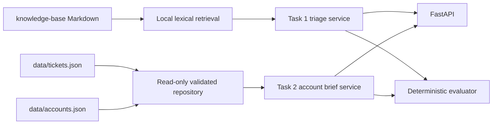

# US Delivery AI

## Project Overview

US Delivery AI is a Python/FastAPI submission for technical-support and
technical-account-management workflows. It reads only the supplied synthetic
ticket, account, and Markdown knowledge-base data. Task 1 turns a raw support
ticket into a validated triage result; Task 2 turns an exact account ID into a
deterministic, evidence-grounded TAM brief. Task 3 provides a repeatable
evaluation harness, and [DESIGN.md](DESIGN.md) documents production trade-offs.

## Architecture



- The repository validates the supplied JSON with Pydantic and keeps indexes in
  memory; it never edits data files.
- Retrieval chunks the local Markdown corpus at `---` boundaries and preserves
  document paths/headings. It does not use web search or external documents.
- Task 1 accepts plain text or JSON, retrieves local KB evidence, and returns a
  constrained triage result. An optional OpenAI structured-output path is used
  only if a local API key is configured; otherwise deterministic local logic is
  used.
- Task 2 exact-joins `account_id`, uses timezone-aware `created_at` values for
  the 90-day window, and produces exactly three source-grounded sections.
- FastAPI exposes both services; `evals/` exercises deterministic quality gates.

## Requirements

- Python 3.13 (the included virtual environment and CI use 3.13)
- Dependencies in `requirements.txt`: FastAPI, Pydantic, Uvicorn, OpenAI SDK,
  pytest, httpx (API tests), and Streamlit (optional local UI).

## Setup

```powershell
python -m venv .venv
.venv\Scripts\Activate.ps1
python -m pip install -r requirements.txt
uvicorn app.main:app --reload
```

The single FastAPI entry point is `uvicorn app.main:app --reload`. Open
`http://127.0.0.1:8000/docs` for the interactive API documentation.

## Environment Variables

Copy `.env.example` to `.env` for local configuration. `.env` is ignored by
Git and must never be committed.

| Variable | Purpose | Default |
|---|---|---|
| `APP_ENV` | Runtime label | `development` |
| `APP_HOST` / `APP_PORT` | Local server binding | `127.0.0.1` / `8000` |
| `LOG_LEVEL` | Logging level | `INFO` |
| `OPENAI_API_KEY` | Optional Task 1 structured-output key | blank |
| `OPENAI_MODEL` | Optional Task 1 model | `gpt-4o-mini` |

No real key is stored in this repository. With no `OPENAI_API_KEY`, Task 1 uses
its deterministic local path.

## Task 1 — Intelligent Ticket Triage

`POST /triage` accepts JSON containing `subject` and/or `body`, or a
`text/plain` request body. It returns product area, category, P1–P4 urgency,
reasoning, known-issue state, local KB document path when applicable, responder
team, and a cautious first response.

```powershell
Invoke-RestMethod -Method Post http://127.0.0.1:8000/triage `
  -ContentType 'application/json' `
  -Body '{"subject":"Pipeline timeout","body":"Our pipeline reports ERR_CONNECTION_TIMEOUT after 30s."}'
```

Example response excerpt:

```json
{
  "product_area": "Pipeline Monitoring",
  "issue_category": "Performance",
  "urgency": "P3",
  "known_issue_match": true,
  "relevant_knowledge_base_document": "knowledge-base/troubleshooting/performance-and-integrations.md",
  "recommended_responder_team": "Technical Support"
}
```

The reusable function is `app.services.triage.triage_ticket`.

## Task 2 — TAM Account Health Summariser

`GET /accounts/{account_id}/brief` returns exactly `Executive Summary`, `Open
Risks & Flagged Issues`, and `Recommended Talking Points`.

```powershell
Invoke-RestMethod http://127.0.0.1:8000/accounts/ACC-3336/brief
```

Example response excerpt:

```json
{
  "Executive Summary": ["Omni Consumer Products is recorded as At Risk..."],
  "Open Risks & Flagged Issues": {"statement":"Material account risks or escalation signals are listed below.","flags":[]},
  "Recommended Talking Points": ["Review the recorded At Risk health status..."]
}
```

The reusable function is `app.services.account_brief.summarize_account`.

## Evaluation and Testing

Run the deterministic harness (it rewrites `evals/eval_report.json`):

```powershell
python -m evals.evaluator
```

The report contains per-case pass/fail, 0–1 quality scores, explanations, and
Task 1/Task 2/overall aggregates. Run the full test suite with:

```powershell
python -m pytest -q
```

## Knowledge Base

The nine files under `knowledge-base/` are the entire retrieval corpus. Document
paths are preserved in results; a no-match response does not invent a document.

## Optional UI

The included Streamlit interface reuses the existing Python services without
duplicating business logic:

```powershell
streamlit run streamlit_app.py
```

## Project Structure

```text
app/                 FastAPI entry point, models, retrieval, and services
data/                Supplied synthetic account and ticket data
knowledge-base/      Supplied Markdown retrieval corpus
prompts/             Versioned Task 1 and Task 2 prompts and changelog
evals/               Cases, evaluator, and generated report
tests/               Unit, API, and evaluation tests
DESIGN.md            Task 4 production design note
SUBMISSION_AUDIT.md  Final requirement matrix
streamlit_app.py     Optional thin local UI
```

## Limitations

- The supplied data has very few exact account/ticket joins; Task 2 deliberately
  does not guess from conflicting company names.
- Deterministic triage uses rules and lexical retrieval, so ambiguous prose may
  need human review.
- The optional LLM path is implemented only for Task 1; Task 2 is deterministic.
- The security controls are local-development basics, not a production security
  program; see [DESIGN.md](DESIGN.md).

## Bonus Features

- Prompt versioning and changelog in `prompts/`.
- GitHub Actions CI runs tests and evaluations.
- Optional Streamlit UI.
